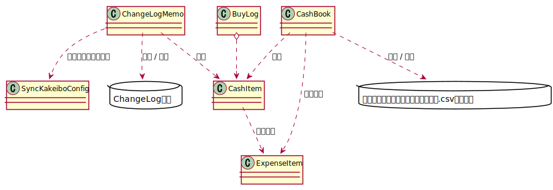

# SyncKakeibo

個人で運用しているChangeLogメモ上の買い物ログと
Android用家計簿アプリ「かけ～ぼ」の同期をとるためのスクリプト

## 背景

- 昔(スマホ登場以前)からChangeLogメモ上に家計簿をつけていた(買い物ログ)
- Androidスマホを使うようになり、買い物ログをスマホアプリ上で確認できるようにしたいと考えた
- AndroidとPC間でデータを同期できる家計簿アプリを探したところ、かけ～ぼがよさそうだったので選択
- 家計簿アプリのデータをPCと同期した上で、PC側にて家計簿アプリのデータとChangeLogメモの買い物ログとをマージするようにする
  - データをマージした後、家計簿アプリとChangeLogメモそれぞれにマージ後の内容を反映したい

## 仕組み

- 家計簿アプリのデータをDropBoxにエクスポートする
- PC側で専用のスクリプト(このリポジトリで管理)を実行し、下記を行う
  - 家計簿アプリのデータファイルを読み、家計簿データ①を生成
  - ChangeLogメモの買い物ログのデータを読み、家計簿データ②を生成
  - ①と②をマージする → ③
  - ③からマージ後の家計簿アプリデータファイルを生成する → ④
  - ③のデータをChangeLogメモに書き戻す(家計簿アプリ側の情報をChangeLogメモ側に反映する)
- 家計簿アプリ側で④をインポートする(ChangeLoeメモ側の情報を家計簿アプリ側に反映する)




## 対応バージョン

下記バージョンのデータで確認

かけ～ぼ 1.68.0

## スクリプトが想定する家計簿アプリのデータ形式

以下、スクリプトで扱うデータについてのみ記載する。

いずれも、CSV形式で文字コードはUTF-8、改行コードはLF

### cashbook.csv

```
No,日付,収入,支出,費目名,収支区分,メモ,帳簿コード,支払コード,請求日&支払回数,請求No,送金元orチャージ
"9999999","99991231","0","0","件数=19941  count=19941","支出","メモ","0","0",,,
```

- 12列構成

- 以前はこのファイルが家計簿データ本体だった気がするが、どこかの時点で扱いが変わった様子
- 現在はヘッダ行とデータ行1行の計2行のデータファイル
- トータル件数が記載されているので、ここを更新する
 - 件数は後述の`cashbook_all.csv`のデータ件数になる

### cashbook_all.csv

```
No,日付,収入,支出,費目名,収支区分,メモ,帳簿コード,支払コード,請求日&支払回数,請求No,送金元orチャージ
"1","20031003","0","19190","趣味・娯楽費","支出","演劇XXX","0","0",,,
"2","20040506","0","18900","その他","支出","YYY温泉","0","0",,,
"3","20040619","0","130250","その他","支出","エアコンZZ-32-ABC-X","0","0",,,
...
```

- 12列構成

- 1列目は1から始まる連番
- 2列目は日付(YYYYMMDD)
- 3列目は収入金額(収支区分が"収入"の場合)
  - 支出の場合は0になる
- 4列目は支出金額(収支区分が"支出"の場合)
  - 収入の場合は0になる
- 5列目は費目
  - ChangeLogメモ上の買い物ログとは費目名称が異なるので対応するものに置き換える(後述)
- 6列目の値が"支出""収入"を示す
  - 後述するChangeLogメモでは金額の正負により支出/収入を分けているのでここを合わせる必要あり
- 7列目は説明
  - 空欄を許容する
- 8,9列目は"0"で固定(自分の使い方の場合)
- 10～12列目は空欄(自分は使ってない)

## ChangeLogメモ上の買い物ログの書式

- アイテムヘッダのカテゴリを`買い物ログ`とする
- アイテムヘッダのタイトルは空欄
- コンテンツ部分に1行に一つの支出データを記載する
  - 費目 説明 金額を記載する(金額が正の場合は支出、負の値の場合は収入)

```
	* 買い物ログ:
	交 駐車場代 800
	食 スーパーA 2432
```

## 費目の対応表

|費目(買い物ログ側)|費目(家計簿アプリ側)|説明|
|--|--|--|
|食|食費|食費(スーパー、コンビニなど)|
|保|保険|生命/火災保険(自動車保険は含めない)|
|貯|貯蓄|貯蓄性商品(確定年金/株/投資信託など)|
|本|書籍|書籍、雑誌など(漫画や小説は娯楽費扱い)|
|酒|酒代|酒類(ノンアルコール飲料は食費扱い)|
|外|外食|外食、ベーカリーやコーヒーショップのテイクアウトもここに含む|
|住|住宅|家関連費用(家賃、住宅ローン返済、固定資産税)、収入のうち住宅ローン用返済口座に振り込まれるもの|
|活|生活費|家具家電/雑貨/衛生消耗品・理容・美容・化粧品|
|雑|嗜好品|嗜好品(おやつ、飲料など)、ここの扱いはちょっと微妙..|
|交|交通費|電車運賃、定期代、ガソリン代・高速代、駐車場代|
|娯|趣味・娯楽費|遊び関連の費用、趣味・娯楽費、旅行、個人的な買い物、季節イベントもの(例:正月飾り)|
|服|衣服|衣類。かばんや靴などもここに分類する。ただし学校で使うもの(制服、内履き、水着など)は教育費に計上する。|
|通|通信費|電話、プロパイダ費用、はがき/切手代|
|光|光熱費|電気、水道、ガス料金|
|医|医療費|医療費・医薬品|
|育|教育費|教育費(月謝、文房具、学費など)|
|車|車維持費|車維持関連の出費(自動車保険・自動車税、修理費など)|
|際|交際費|交際費(冠婚葬祭・贈答品、飲み会)|
|他|その他|上記で分類できない出費、給与賞与|

## 実装についてのメモなど

### 設定ファイル

一部の設定を設定ファイルに逃がしている。

- スクリプトと同じディレクトリに`kakeibo.ini`という名前で置く
- INI形式

- 個人的な情報を含んでいるためリポジトリの管理対象外にする

- スクリプト上はSyncKakeiboConfigクラス経由でこの設定ファイルにアクセスする

### 設定値

- SETTING::CHANGELOGMEMOFILEPATH
  - ChangeLogメモファイルのパス
- SETTING::KAKEIBODIR
  - 家計簿アプリのエクスポートデータが置かれるディレクトリ
- SETTING::NAME
  - ChangeLogメモのエントリヘッダに記載する名前
- SETTING::MAILADDRESS
  - ChangeLogメモのエントリヘッダに記載するメールアドレス

### 家計簿アプリのデータの読み込み

- エクスポートデータが置かれるディレクトリ内にある`cashbook_all.csv`を読む

- 1行目を読み、ヘッダの内容が想定通りかをチェックする
  - 列の数
  - 列の各項目名が想定するものであるか
  - 想定と異なる場合はエラー終了する
    - 家計簿アプリのバージョンアップに伴う仕様変更が発生しているはずなので、スクリプト側で追従する必要がある

- 2行目以降を読み、CashItemオブジェクトを生成して保持する  
このとき、以下の変換を行っている
  - 家計簿アプリ上の費目名を費目ID(数値)に変換する

### 費目名と費目ID

家計簿アプリの費目とChangeLogメモの買い物ログ上の費目の名前が異なる。  
家計簿アプリの各費目と買い物ログ上の各費目についてはそれぞれ、1対1で対応する形にしている

スクリプトで変換するとき、中間形式で保持するので、そこでは費目を費目IDとして扱う。

それぞれのデータ形式に書き戻す際に、費目IDからそれぞれの費目名に変換する

ここに記載した費目の名前とIDの相互変換をExpenseItemクラスで行っている。

### ChangeLogメモのデータの読み込み

ChangeLogメモを読み、エントリヘッダの日付を保持する

`\t* 買い物ログ:`というアイテムが現れたら買い物ログとして認識する

買い物ログ内の各行の情報からCashItemオブジェクトを生成して保持する。

このとき、以下の変換を行っている。
- 買い物ログ上の費目名を費目ID(数値)に変換する
- 買ったものの説明が`(記載なし)`だった場合、空文字列として保持する
  - 家計簿アプリ側の仕様として説明を空欄にすることを許容しているため
  - 逆に買い物ログ上は説明なしを想定していないため、`(記載なし)`として扱う

### マージ

家計簿アプリと買い物ログのそれぞれから生成したCashItemオブジェクトのリストを合わせる。

このとき、同一アイテムは同一のものとして扱う必要があるので、同一判定を行う。
以下が同じなら同一とみなす。

- 日付
- 費目ID
- 説明
- 金額

### ChangeLogメモのデータの更新

元のファイルを別ファイルとして退避する(元のファイル名+`.bak`)

退避したファイルを1行ずつ読み、元ファイルがあった場所に出力していく。

このとき、エントリーヘッダの日付を覚えておく

日付が出てきた時点で、それより未来の日付の買い物ログが未出力だったら、それらを出力する。
- 出力済の日付を記憶しておく

`\t* 買い物ログ:`行が現れたら、マージ後の当日のCashItemオブジェクトから買い物ログを生成し、出力する
- CashItemの説明が空文字列の場合は`(記載なし)`に置き換える

当日に買い物ログが存在せず、一方で、当日のCashItemが存在する場合は、当日の最下方のアイテムとして買い物リストを新規生成する。
- これは、家計簿アプリ側のみにデータが存在するケース


買い物ログ以外の行は単に退避ファイルからコピーする形で出力する

### 家計簿アプリのデータの更新

家計簿アプリの場合は、ChangeLogメモとは異なり、既存ファイルをベースに生成する必要がない(ファイル丸ごと更新できる)ので、`cashbook.csv`と`cashbook_all.csv`を全部生成する。

事故に備えて、更新前のファイルを`.bak`として退避する

## 改訂履歴

- 2023/07/29 追記

- 2023/07/28 新規作成

